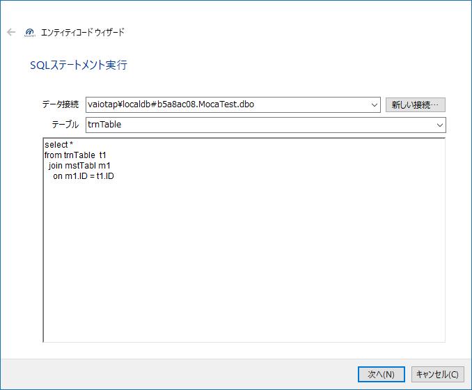

# TemplateVSPackage

[](https://ci.appveyor.com/project/miyabis/templatevspackage)
[](https://ci.appveyor.com/project/miyabis/templatevspackage-qdu06)

Moca.NET framework Templates.

**Project Templates** (Only supports VB.NET code)

* Moca.NET Windows Forms application 
* Moca.NET Web application 

**Item Template** (supports VB.NET and C# code)

for Moca.NET

* Dao class template 
* Entity Wizard 
* Web User Control template 
* Web Form template 
* Web Master Page template 
* Web Session interface template 
* Web Cookie interface template 
* Web API Controller template 
* IMethodInterceptor implements class template 
* SQL statements Interceptor implements class template 

for Selenium

* Selenium Test Class
* Selenium Test Page Class
* Selenium Test PageObject Class Wizard


How to get
==========

vs2012 or later : [Moca.NET Template 3.0](https://visualstudiogallery.msdn.microsoft.com/7735e52f-74f2-4ac7-8172-11cde77e6290)  
vs2010 : [Moca.NET Templates 2010](https://visualstudiogallery.msdn.microsoft.com/f97a7486-560b-425a-aa05-528dd397f5ba)


Entity Wizard 
=======

It's the wizard into which a used entity class is formed from a SQL statement to use Moca.NET.




```vb
'------------------------------------------------------------------------------
' <auto-generated>
'     このコードはツールによって生成されました。
'     ランタイム バージョン:4.0.30319.42000
'
'     このファイルへの変更は、以下の状況下で不正な動作の原因になったり、
'     コードが再生成されるときに損失したりします。
' </auto-generated>
'------------------------------------------------------------------------------

Option Strict Off
Option Explicit On

Imports Moca.Db
Imports Moca.Db.Attr
Imports System.ComponentModel


''' <summary> 
''' EntityClass1 エンティティ 
''' </summary> 
''' <remarks></remarks> 
''' <history> 
''' </history> 
Public Class EntityClass1
    Implements System.ComponentModel.INotifyPropertyChanged
    
    #Region " Declare "
    Private _id As Integer
    
    Private _note As String
    
    Private _name As String
    #End Region
    
    #Region " Property "
    ''' <summary> 
    ''' Id (Id) Property. 
    ''' </summary> 
    <Column("Id")>  _
    Public Property Id() As Integer
        Get
            Return Me._id
        End Get
        Set
            Me._id = value
            OnPropertyChanged("Id")
        End Set
    End Property
    
    ''' <summary> 
    ''' Note (Note) Property. 
    ''' </summary> 
    <Column("Note")>  _
    Public Property Note() As String
        Get
            Return Me._note
        End Get
        Set
            Me._note = value
            OnPropertyChanged("Note")
        End Set
    End Property
    
    ''' <summary> 
    ''' Name (Name) Property. 
    ''' </summary> 
    <Column("Name")>  _
    Public Property Name() As String
        Get
            Return Me._name
        End Get
        Set
            Me._name = value
            OnPropertyChanged("Name")
        End Set
    End Property
    #End Region
    
    Public Event PropertyChanged As System.ComponentModel.PropertyChangedEventHandler Implements System.ComponentModel.INotifyPropertyChanged.PropertyChanged
    
    Protected Overridable Sub OnPropertyChanged(ByVal name As String)
        RaiseEvent PropertyChanged(Me, New System.ComponentModel.PropertyChangedEventArgs(name))
    End Sub
End Class
```


Selenium Test PageObject Class Wizard
=======

Wizards which makes a PageObject class of selenium from a Web page.


```vb
'------------------------------------------------------------------------------
' <auto-generated>
'     このコードはツールによって生成されました。
'     ランタイム バージョン:4.0.30319.42000
'
'     このファイルへの変更は、以下の状況下で不正な動作の原因になったり、
'     コードが再生成されるときに損失したりします。
' </auto-generated>
'------------------------------------------------------------------------------

Option Strict Off
Option Explicit On

Imports MiYABiS.SeleniumTestAssist
Imports OpenQA.Selenium
Imports OpenQA.Selenium.Support.PageObjects


''' <summary> 
''' PageObject1 PageObjects  
''' </summary> 
''' <remarks></remarks> 
''' <history> 
''' </history> 
Public Class PageObject1
    Inherits SeleniumAction

#Region " Declare "
    <FindsBy([Using]:="service-alert")>
    Private _serviceAlert As IWebElement

    <FindsBy([Using]:="outer-wrapper")>
    Private _outerWrapper As IWebElement

    <FindsBy([Using]:="content-wrapper")>
    Private _contentWrapper As IWebElement

    <FindsBy([Using]:="layout-footer")>
    Private _layoutFooter As IWebElement

    <FindsBy([Using]:="body")>
    Private _body As IWebElement

    <FindsBy([Using]:="logo")>
    Private _logo As IWebElement

    <FindsBy([Using]:="header-sidebox")>
    Private _headerSidebox As IWebElement

    <FindsBy([Using]:="searchBox")>
    Private _searchBox As IWebElement

    <FindsBy([Using]:="searchBoxInput")>
    Private _searchBoxInput As IWebElement

    <FindsBy([Using]:="searchBoxSubmit")>
    Private _searchBoxSubmit As IWebElement

    <FindsBy([Using]:="menu")>
    Private _menu As IWebElement

    <FindsBy([Using]:="UniquePackages")>
    Private _uniquePackages As IWebElement

    <FindsBy([Using]:="Downloads")>
    Private _downloads As IWebElement

    <FindsBy([Using]:="TotalPackages")>
    Private _totalPackages As IWebElement

    <FindsBy([Using]:="footer")>
    Private _footer As IWebElement

    <FindsBy([Using]:="releaseTag")>
    Private _releaseTag As IWebElement
#End Region

    Public Sub New(ByVal driver As IWebDriver)
        MyBase.New(driver)
    End Sub
End Class
```


License
=======

Microsoft Public License (MS-PL)

http://opensource.org/licenses/MS-PL
